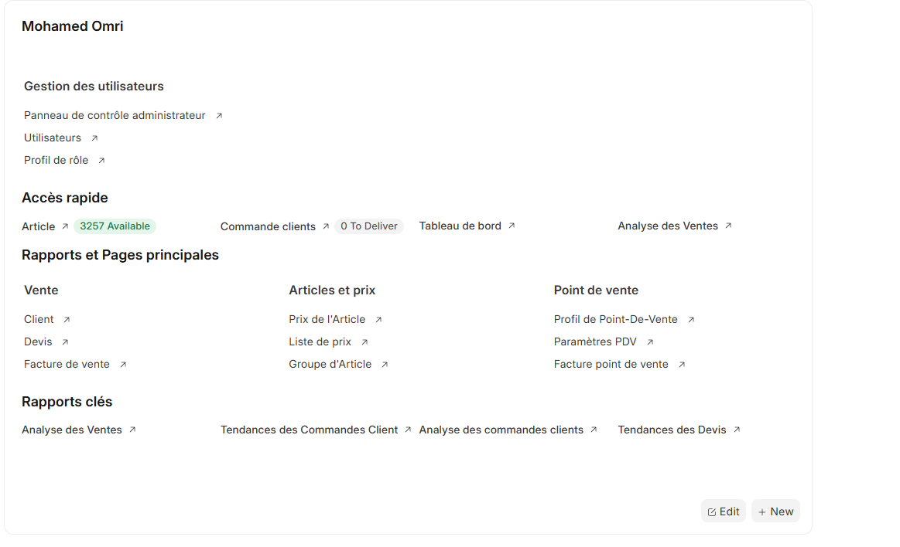

# Opérations Quotidiennes

L'interface principale vous donne accès à tous les outils nécessaires pour superviser et gérer les opérations quotidiennes du magasin.

## Accès Rapide aux Fonctions Critiques

La section "Accès rapide" centralise les informations essentielles pour le suivi quotidien :

- **Articles** : Visualisation du stock disponible (3257 articles disponibles dans l'exemple)
- **Commandes clients** : Suivi des commandes en cours avec indicateur de statut
- **Tableau de bord** : Vue d'ensemble des performances
- **Analyse des ventes** : Rapports et statistiques en temps réel

> Les indicateurs visuels (comme "0 To Deliver") vous alertent immédiatement sur les actions requises.
