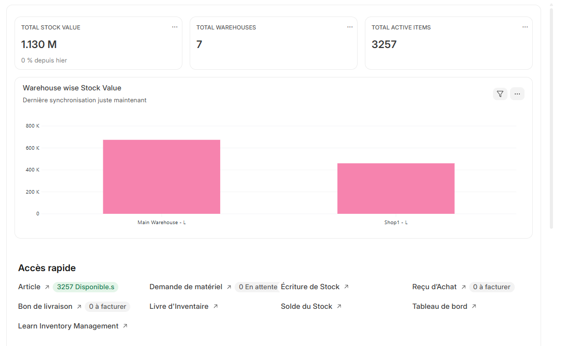
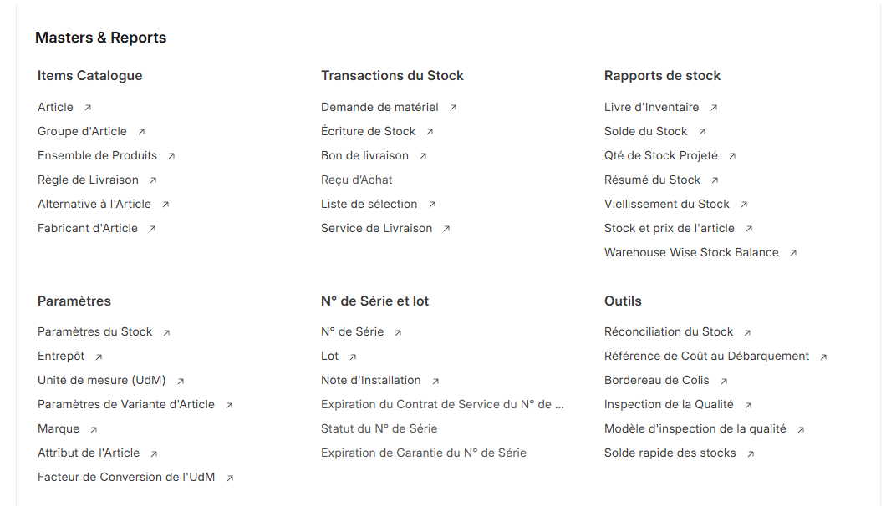

# Opérations Quotidiennes

L'interface principale vous donne accès à tous les outils nécessaires pour superviser et gérer les opérations quotidiennes du magasin.

## Accès Rapide aux Fonctions Critiques

La section "Accès rapide" centralise les informations essentielles pour le suivi quotidien :

- **Articles** : Visualisation du stock disponible (3257 articles disponibles dans l'exemple)
- **Commandes clients** : Suivi des commandes en cours avec indicateur de statut
- **Tableau de bord** : Vue d'ensemble des performances
- **Analyse des ventes** : Rapports et statistiques en temps réel

> Les indicateurs visuels (comme "0 To Deliver") vous alertent immédiatement sur les actions requises.

## Rapports et Pages principales

### 1️. Ventes

La section **Ventes** vous permet de suivre tous vos clients et transactions :

- **Clients**  
  - Liste complète des clients.  
  - Possibilité de créer un nouveau client ou modifier les informations existantes.  

- **Devis**  
  - Suivi des devis envoyés aux clients.  
  - Statut : en cours / accepté / refusé.  

- **Factures de ventes**  
  - Visualisation et suivi des factures générées.  
  - Statut : payée, partiellement payée, non payée.  
  - Filtrage par client, date ou état de la facture.  

> Pour les procédures détaillées d'utilisation des actions de **vente**, consultez le chapitre [Guide du Caissier](../cashier/getting_started.md).  

### 2️. Articles et Prix

Cette page vous permet de gérer et consulter votre catalogue de produits :

- **Articles**  
  - Vue d’ensemble du catalogue de produits.  
  - Stock disponible dans chaque entrepôt ou magasin.  

- **Groupes d’articles**  
  - Organisation des articles par catégorie pour faciliter la navigation.  

- **Listes de prix**  
  - Visualisation des prix pour chaque type de vente (détail, gros, promotion).  
  - Gestion de plusieurs listes de prix selon les clients ou magasins.  

---

### 3️. POS (Point de Vente)

Le module POS permet de gérer vos ventes sur chaque magasin :

- **Profils POS**  
  - Chaque magasin a son POS associé (ex. Shop 1 → POS 1).  
  - Gestion des utilisateurs et rôles pour chaque POS.  

- **Paramètres POS**  
  - Modes de paiement par défaut.  
  - Mise en page des tickets, logo, taxes et autres paramètres.  

- **Factures POS**  
  - Suivi des ventes effectuées via POS.  
  - Filtrage par date, magasin ou client.  

---

### Stock et Inventaire

La section **Stock** vous permet d'avoir une vue globale sur la disponibilité des articles dans vos différents entrepôts et magasins.

  

Vous pouvez consulter :

- Les **Écriture de Stock** et **Solde du Stock** pour voir les mouvements d'entrée et de sortie des articles.
- Le **Livre d'inventaire** pour le détail complet des transactions de chaque article.
- Les informations détaillées de chaque produit : quantité disponible, entrepôt associé, et historiques de mouvements.
- Des outils pratiques pour réaliser l’inventaire et configurer correctement les stocks lors de la mise en place initiale.

> Pour les procédures détaillées de gestion et de suivi des stocks, consultez le chapitre [Guide du Travailleur d'Entrepôt](../warehouse-worker/getting_started.md).  