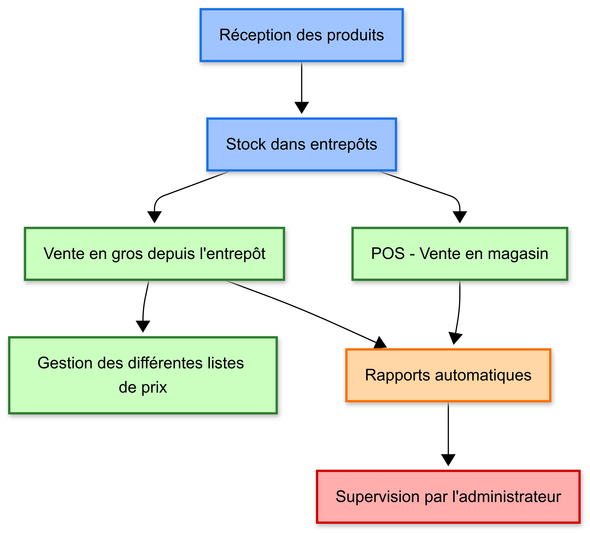
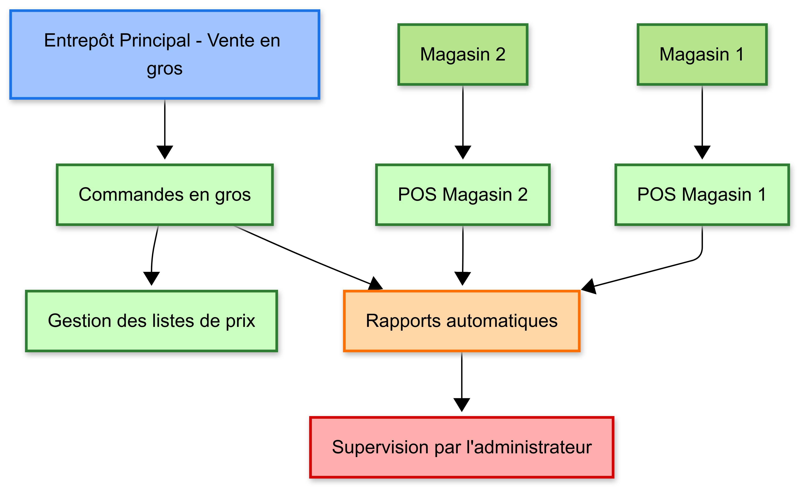

# Vue d'ensemble pour l'Administrateur

## Objectif du Système
L'intégration d'ERPNext dans votre magasin a été réalisée pour simplifier et automatiser la gestion quotidienne.  
Elle permet de suivre les ventes, gérer les stocks, superviser les caissiers et obtenir des rapports précis sans effort.

## Portée
Ce système couvre toutes les opérations essentielles du magasin :  
- Gestion des ventes via le POS  
- Suivi des stocks et des entrepôts  
- Gestion des utilisateurs et des rôles  
- Génération de rapports et statistiques  

## Rôles et Permissions

- **Propriétaire / Administrateur** : accès complet à toutes les fonctionnalités, peut ajouter/supprimer des utilisateurs, configurer les entrepôts et consulter tous les rapports.  

- **Caissiers** : accès limité à l'interface de vente, peuvent effectuer des transactions mais n'ont pas accès aux paramètres ou rapports complets.

- **Employés d'Entrepôt** : gèrent les ventes en gros depuis l'entrepôt principal, créent et traitent les commandes clients (Sales Orders), génèrent les bons de livraison (Delivery Notes) et supervisent les expéditions. Ils ont accès aux fonctionnalités de gestion des stocks et peuvent consulter les rapports liés à leur entrepôt.
## Workflow Global
Le flux général des opérations est le suivant :  
1. Réception des produits et mise à jour du stock dans les différents entrepôts.  
2. Vente des produits via le POS pour les clients en magasin.  
3. Vente en gros directement depuis l'entrepôt, avec gestion des prix spécifiques selon le type de client.  
4. Gestion de la hiérarchie des entrepôts pour suivre précisément où se trouvent les produits et leur disponibilité.  
5. Génération automatique des rapports de ventes et des états de stock.  
6. Supervision et suivi par l’administrateur, incluant l’analyse des ventes et le contrôle des stocks.

## Fonctionnalités Clés
- Support multi-entrepôts et suivi précis des stocks.  
- Interface POS simple et intuitive pour les caissiers.  
- Rapports de vente automatiques et détaillés.  
- Gestion facile des utilisateurs et rôles.  
- Outils de dépannage rapide pour les problèmes courants.

## Bénéfices
- Gain de temps dans la gestion quotidienne.  
- Réduction des erreurs dans les ventes et la gestion des stocks.  
- Visibilité claire sur les performances du magasin.  
- Possibilité de gérer plusieurs caissiers tout en conservant la traçabilité des ventes.

## Représentation Visuelle 

*Diagramme montrant le flux des opérations du magasin depuis la réception des produits jusqu'à la supervision administrative.*
## Hiérarchie des Entrepôts

*Structure organisationnelle des entrepôts et points de vente avec leurs flux respectifs.*