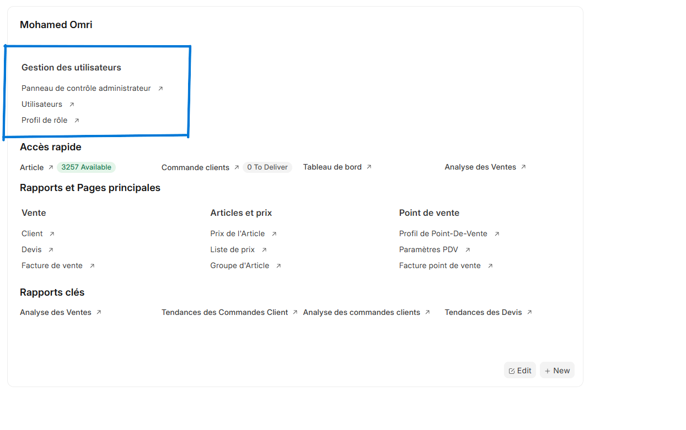
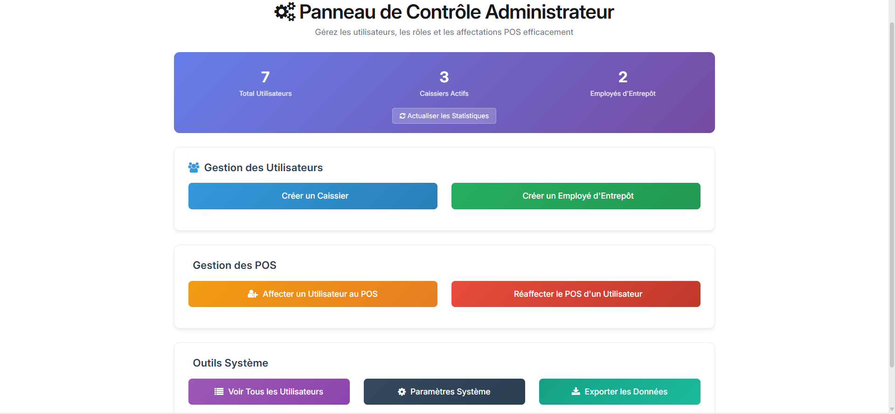
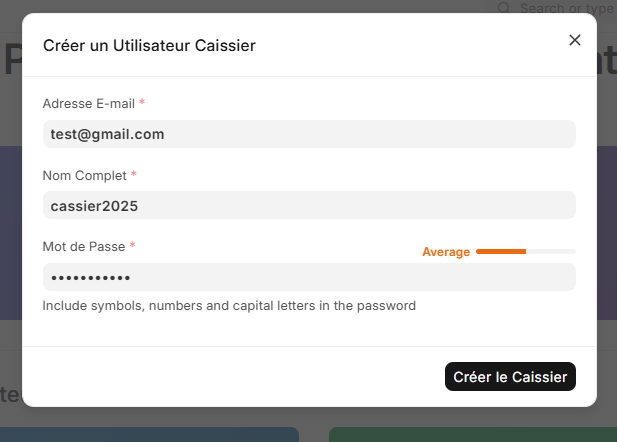
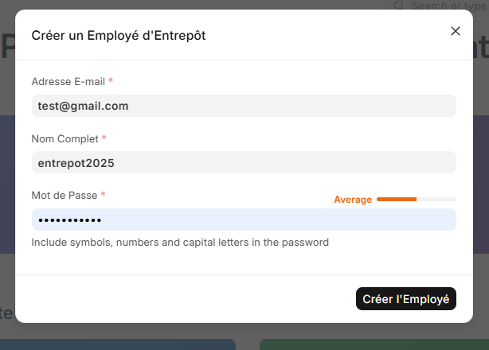
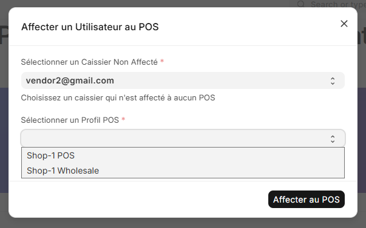
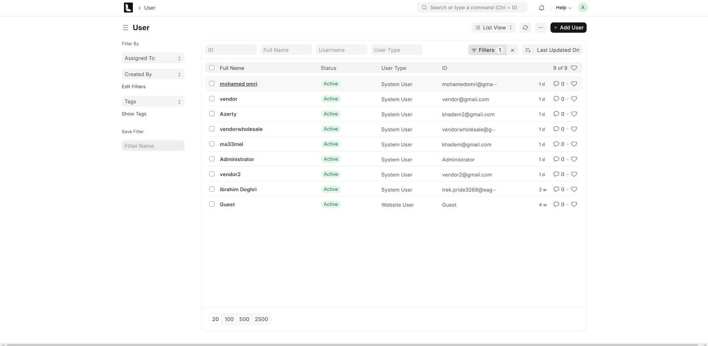

# Setup du Système

## Accès au Système et Sécurité

Pour garantir la sécurité de votre compte administrateur et des informations du magasin, veuillez suivre ces bonnes pratiques :

- **Mot de passe fort** : utilisez une combinaison de lettres, chiffres et caractères spéciaux.  
- **Déconnexion après utilisation** : toujours se déconnecter sur un ordinateur partagé ou public.  
- **Conservation des identifiants** : garder vos informations de connexion dans un endroit sûr et confidentiel.

## Interface Principale d'Administration

Votre espace de travail administrateur centralise tous les outils nécessaires à la gestion quotidienne du magasin.

L'interface se compose de plusieurs sections principales :

**Gestion des utilisateurs** - Outils de création et administration des comptes  
**Accès rapide** - Raccourcis vers les fonctions les plus utilisées  
**Rapports et Pages principales** - Liens directs vers les analyses de vente  
**Rapports clés** - Tableaux de bord et statistiques en temps réel

Cette interface vous permet d'accéder rapidement à toutes les fonctionnalités administratives. 

> Pour les procédures détaillées d'utilisation de chaque section, consultez le chapitre [Opérations Quotidiennes](daily_ops.md).

## Gestion des Utilisateurs et Rôles

L'interface d'administration vous donne accès à tous les outils de gestion des utilisateurs depuis un panneau centralisé.

### 1. Panneau de contrôle administrateur

Le panneau de contrôle vous donne accès aux fonctionnalités principales :

- Visualisation des statistiques des utilisateurs actifs
- Visualisation du nombre de caissiers actifs  
- Visualisation du nombre d'employés d'entrepôt actifs
- Création de nouveaux comptes caissiers
- Création de nouveaux comptes employés d'entrepôt
- Affectation des caissiers à leurs postes POS
- Accès à la liste complète des utilisateurs
- Accès aux paramètres système

### 2. Gestion des Utilisateurs

#### 2.1 Créer un Caissier

Pour créer un nouveau compte caissier :

- Cliquer sur "Créer un Caissier" dans la section Gestion des Utilisateurs
- Saisir l'adresse e-mail du nouveau caissier
- Entrer le nom complet de l'employé
- Définir un mot de passe temporaire
- Cliquer sur "Créer le Caissier" pour valider

#### 2.2 Créer un Employé d'Entrepôt

Pour créer un nouveau compte employé d'entrepôt :

- Cliquer sur "Créer un Employé d'Entrepôt" dans la section Gestion des Utilisateurs
- Saisir l'adresse e-mail du nouvel employé
- Entrer le nom complet de l'employé
- Définir un mot de passe temporaire
- Cliquer sur "Créer l'Employé" pour valider

#### 2.3 Affecter un Caissier à son POS

Pour affecter un caissier à un poste de vente :

- Cliquer sur "Affecter un Utilisateur au POS" dans la section Gestion des POS
- Sélectionner le caissier non affecté dans la liste déroulante
- Choisir le profil POS approprié (Magasin 1, Magasin 2, etc.)
- Cliquer sur "Affecter au POS" pour confirmer

#### 2.4 Consulter la Liste des Utilisateurs

Pour accéder à la gestion complète des utilisateurs :

- Cliquer sur "Voir Tous les Utilisateurs" dans la section Outils Système
- Visualiser tous les comptes créés avec leurs rôles
- Modifier les informations utilisateur si nécessaire
- Activer/désactiver des comptes
- Réinitialiser les mots de passe

