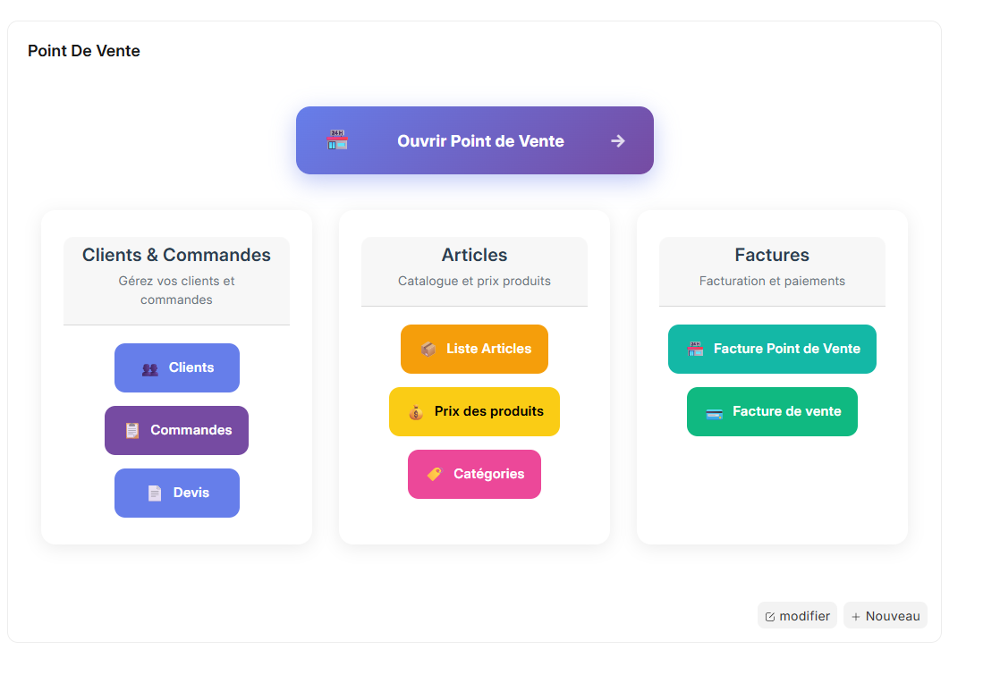

# Guide du Caissier – Premiers Pas

Bienvenue dans votre espace de travail principal pour la gestion des ventes quotidiennes. Cette page vous présente une vue d’ensemble de l’interface et de ses sections clés.

---

## 1. Vue d’ensemble du Workspace

Votre interface principale centralise toutes les fonctions nécessaires pour gérer les ventes et consulter rapidement les informations importantes.

---

## 2. Ouvrir le Point de Vente

La section Ouvrir le Point de Vente vous permet d’accéder à l’écran principal de vente.
Vous pourrez scanner les articles, les ajouter au panier et finaliser la vente.
> Pour les procédures détaillées de la point de vente, consultez les chapitres suivants du [Guide du Caissier](../cashier/sales.md).

---

## 3. Clients et Commandes

Dans cette section, vous pouvez :  
- Visualiser la liste complète des clients.  
- Suivre les commandes et les devis, en cours ou terminés.  
- Vérifier rapidement le statut des commandes grâce aux indicateurs visuels.

---

## 4. Articles

La section **Articles** vous permet de :  
- Consulter les articles disponibles.  
- Voir les informations principales : prix, catégories.  
- Rechercher rapidement un article par nom ou code.

---

## 5. Factures

Dans **Factures**, vous pouvez :  
- Visualiser les factures générées.  
- Vérifier le statut de paiement : payé, partiellement payé, non payé.  
- Filtrer les factures par client ou par date.

---

> Pour les procédures détaillées d’utilisation de chaque action de vente, consultez les chapitres suivants du [Guide du Caissier](../cashier/sales.md).

