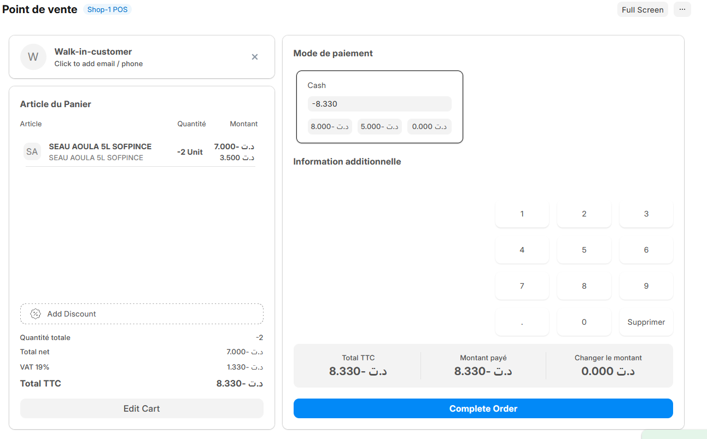

# Guide du Caissier – Retours POS

## Interface des Retours POS

L'interface de retours POS vous permet de traiter rapidement les retours de marchandises avec remboursement immédiat :

- **Recherche de transaction** : Retrouver la vente originale
- **Sélection des articles** : Choisir les articles à retourner
- **Motif de retour** : Spécifier la raison du retour
- **Zone de remboursement** : Calculer et traiter le remboursement

---

## 1. Accéder aux Retours POS

### Depuis l'interface POS principale :

1. **Cliquez sur le bouton "toggle commandes recentes"** dans la barre de navigation POS
2. **Ou utilisez le raccourci** : Ctrl + R
3. **L'interface de retours s'ouvre** avec les options de recherche

---

## 2. Rechercher la Transaction Originale

### Méthodes de recherche :

**Par numéro de reçu :**

- Saisissez le numéro de facture/reçu
- Cliquez sur "Rechercher"
- La transaction s'affiche avec tous ses détails

**Par date et client :**

- Sélectionnez la date de vente
- Choisissez le client (si connu)
- Parcourez la liste des transactions

**Par scan du reçu :**

- Utilisez le scanner pour lire le code-barre du reçu
- La transaction se charge automatiquement

> **Important** : Seules les transactions des 30 derniers jours sont disponibles pour retour direct via POS.

---

## 3. Sélectionner les Articles à Retourner

Une fois la transaction trouvée :

### Processus de sélection :

1. **Visualisez tous les articles** de la transaction originale
2. **Cochez les articles à retourner** dans la liste
3. **Ajustez les quantités** si retour partiel :
   - Cliquez sur le champ quantité
   - Modifiez selon le nombre d'articles retournés
   - La quantité ne peut pas dépasser la quantité vendue
4. **Vérifiez les prix** : Les prix originaux s'affichent automatiquement

### Types de retours :

- **Retour complet** : Tous les articles de la transaction
- **Retour partiel** : Seulement certains articles
- **Retour de quantité** : Une partie de la quantité d'un article

---

## 4. Processus de Remboursement

### Calcul automatique :

Le système calcule automatiquement :

- **Montant des articles** retournés
- **Taxes à rembourser** (TVA, etc.)
- **Total du remboursement**

### Méthodes de remboursement :

1. **Remboursement en espèces**
   - Pour les ventes payées en cash
   - Sortez le montant de votre caisse

2. **Remboursement par carte**
   - Pour les ventes payées par carte
   - Utilisez le terminal de paiement pour créditer

### Étapes de finalisation :

1. **Vérifiez le montant** du remboursement
2. **Sélectionnez la méthode** de remboursement
3. **Traitez le paiement** selon la méthode choisie
4. **Cliquez sur "Finaliser le retour"**