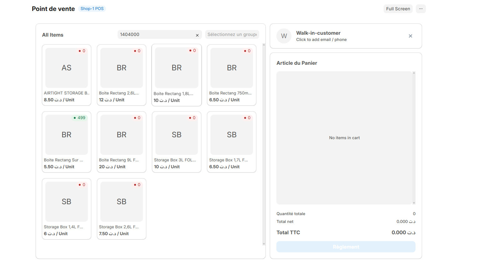
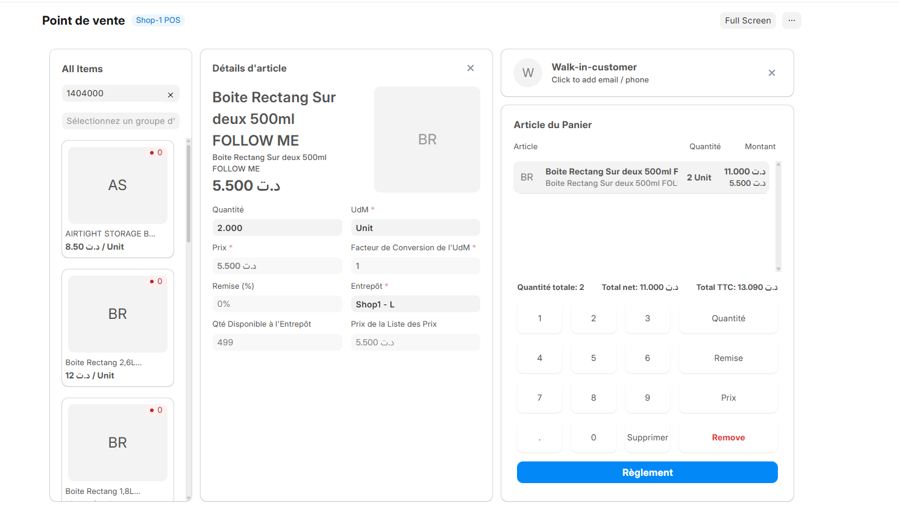
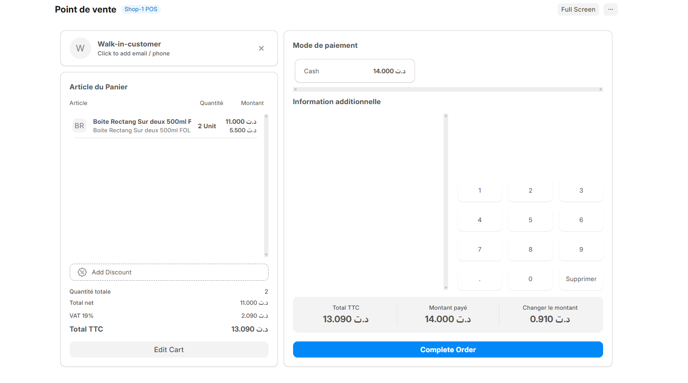
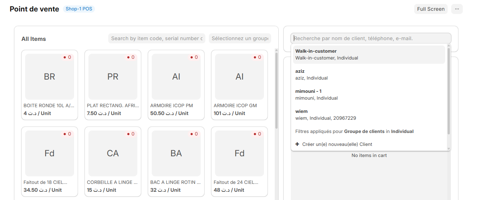
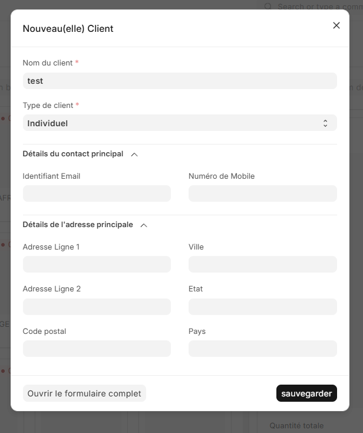
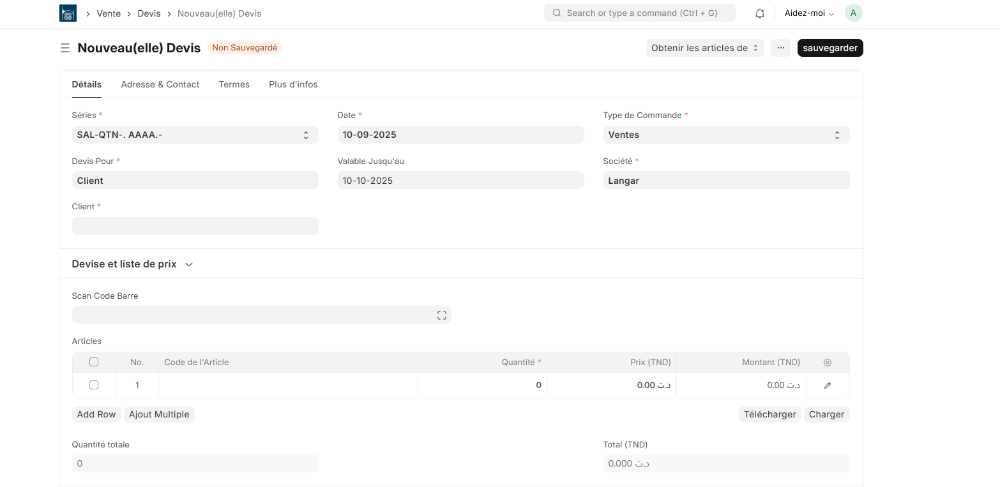
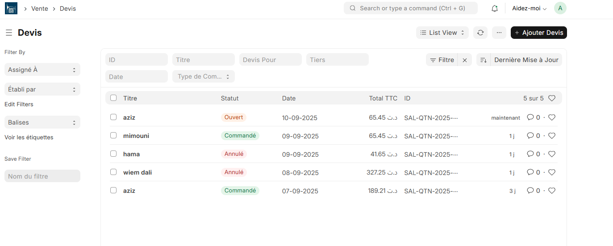
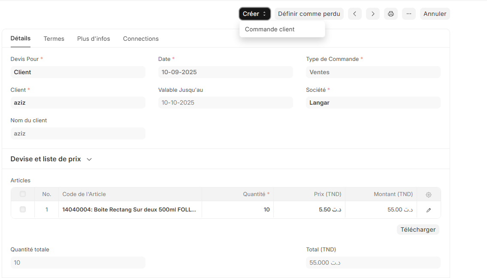
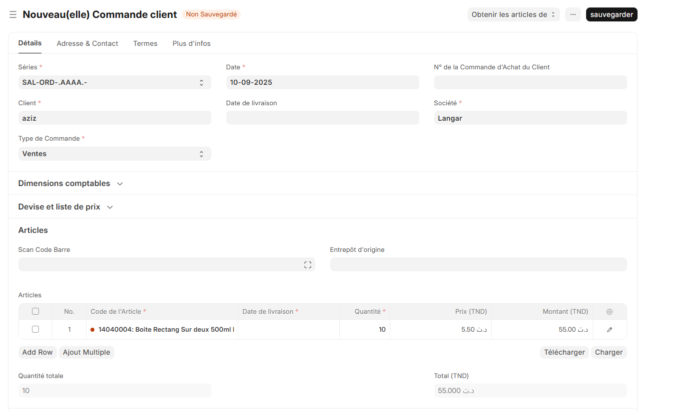
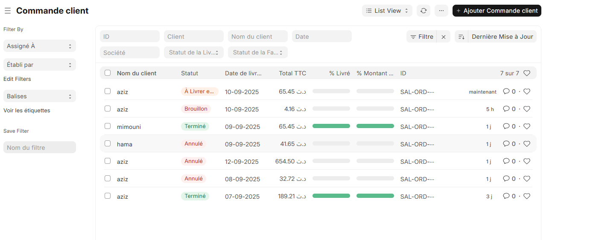

# Guide du Caissier – Ventes et Point de Vente

## Part 1: Point de Vente (POS) - Ventes Directes

Le Point de Vente (POS) est l'interface principale pour les ventes immédiates avec paiement instantané. Cette section vous guide à travers le processus complet de vente.

---

### Interface du Point de Vente

L'interface POS ERPNext vous offre une vue complète pour gérer vos ventes en temps réel :

- **Zone de produits** : Catalogue visuel des articles disponibles
- **Panier de vente** : Articles sélectionnés pour la vente en cours
- **Zone de paiement** : Options de paiement et finalisation
- **Informations client** : Sélection et détails du client

---

### 1. Ajouter des Articles au Panier

#### Méthodes d'ajout :

- **Scan du code-barre** : Utilisez le scanner pour ajouter automatiquement l'article
- **Sélection visuelle** : Cliquez directement sur l'article dans le catalogue
- **Recherche manuelle** : Tapez le nom ou le code de l'article dans la barre de recherche

#### Gestion des quantités :

- Modifiez la quantité directement dans le panier
- Utilisez les boutons + et - pour ajuster rapidement
- Supprimez un article en cliquant sur l'icône de suppression

---

### 2. Panier de Vente

Le panier affiche :

- **Liste des articles** avec nom, quantité et prix unitaire
- **Sous-total** par article (quantité × prix)
- **Total général** de la vente
- **Taxes applicables** (TVA, etc.)
- **Options de modification** pour chaque article

#### Fonctionnalités du panier :

- **Modification des quantités** : Clic direct sur le champ quantité
- **Application de remises** : Remise par article ou sur le total
- **Suppression d'articles** : Bouton de suppression pour chaque ligne
- **Vidage du panier** : Option pour recommencer la vente

---

### 3. Processus de Paiement

#### Étapes de finalisation :

1. **Vérification du total** : Confirmez le montant final

2. **Sélection du mode de paiement** :
   - Espèces (Cash)
   - Carte bancaire
   - Chèque
   - Virement
   - Paiement mixte (plusieurs méthodes)

3. **Saisie du montant** : 
   - Pour les espèces : saisissez le montant reçu
   - Le système calcule automatiquement la monnaie à rendre

4. **Validation de la vente** : Cliquez sur "Soumettre" pour finaliser

---

### 4. Génération du Reçu

Après validation de la vente :

- **Reçu automatique** : Le reçu s'affiche immédiatement
- **Impression directe** : Envoi vers l'imprimante configurée
- **Options d'envoi** : Email au client si adresse disponible
- **Nouveau panier** : L'interface se remet à zéro pour la vente suivante

#### Informations sur le reçu :

- Détails de la transaction (date, heure, numéro)
- Liste complète des articles vendus
- Montants des taxes
- Mode de paiement utilisé
- Monnaie rendue (si applicable)

---

### 5. Gestion des Clients

#### Vente sans client spécifique :

- Client par défaut automatiquement sélectionné
- Vente rapide sans saisie d'informations

#### Vente avec client identifié :

**Recherche d'un client existant :**

- Tapez le nom ou numéro du client dans la barre de recherche
- Sélectionnez le client dans la liste déroulante
- Les informations client s'affichent automatiquement

**Création d'un nouveau client :**

- Cliquez sur le bouton "+" ou "Nouveau Client"
- Remplissez les informations requises (nom, téléphone)
- Sauvegardez pour l'utiliser immédiatement dans la vente

---

## Part 2: Devis et Commandes de Vente

Cette section couvre le processus complet depuis la demande de devis jusqu'à la commande confirmée.

---

### 1. Création d'un Devis (Quote)

Quand un client demande un devis :

**Étapes de création :**

1. **Nouveau Devis** : Cliquez sur "Nouveau" dans le module Devis
2. **Sélection du client** : Choisissez ou créez le client
3. **Ajout des articles** : Sélectionnez les produits demandés
4. **Sauvegarde** : Enregistrez le devis
5. **Valider** : Valider le devis

#### Informations du devis :

- **Validité** : Date d'expiration du devis
- **Remises** : Remises applicables
- **Taxes** : Calcul automatique des taxes
- **Total** : Montant final du devis

---

### 2. Gestion et Suivi des Devis

**Statuts des devis :**

- **Brouillon** : En cours de préparation
- **Soumis** : Envoyé au client
- **Accepté** : Approuvé par le client
- **Expiré** : Date de validité dépassée
- **Annulé** : Annulé par le client ou l'entreprise

**Actions possibles :**

- **Modifier** : Ajustements avant envoi
- **Envoyer par email** : Transmission au client
- **Imprimer** : Version papier du devis
- **Dupliquer** : Créer un nouveau devis similaire

---

### 3. Conversion Devis → Commande de Vente

**Quand le client accepte le devis :**

1. **Ouvrir le devis accepté**
2. **Cliquer sur "Créer" → "Commande client"**
3. **Vérifier les détails** : Les informations sont automatiquement copiées
4. **Confirmer la commande** : Valider la création

> La commande de vente hérite automatiquement de tous les détails du devis (articles, prix, client, conditions).

---

### 4. Gestion des Commandes de Vente

**Une fois la commande créée :**

#### Statuts de commande :

- **Brouillon** : En cours de finalisation
- **À confirmer** : En attente de confirmation
- **Confirmée** : Commande validée
- **En cours** : Préparation/livraison
- **Livrée** : Commande complète
- **Fermée** : Terminée

#### Actions disponibles :

- **Bon de livraison** : Générer le document de livraison
- **Facture** : Créer la facture
- **Paiement** : Enregistrer les paiements
- **Suivi** : Suivre l'avancement

---

> **Note** : Ce processus est entièrement géré par l'employé de l'entrepôt. Le caissier n'intervient pas dans cette étape.

---

