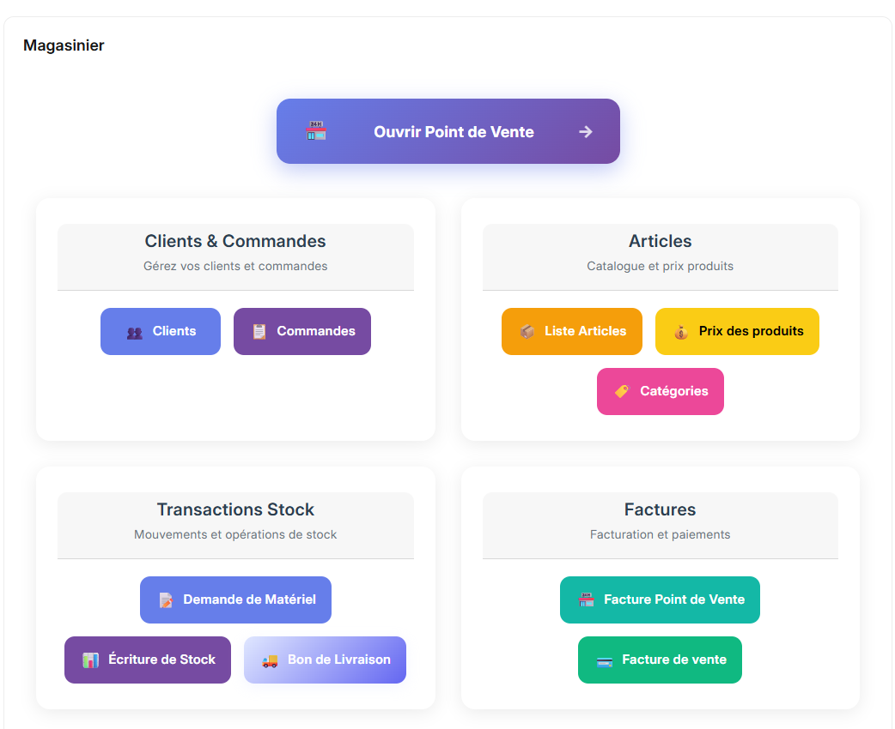

# Guide de l'Employé Entrepôt – Premiers Pas

Bienvenue dans votre espace de travail principal pour la gestion des stocks et des opérations d'entrepôt. Cette page vous présente une vue d'ensemble de l'interface et de ses sections clés.

---

## 1. Vue d'ensemble du Workspace

Votre interface principale centralise toutes les fonctions nécessaires pour gérer les stocks, les mouvements de marchandises et consulter rapidement les informations importantes.

---

## 2. Ouvrir le Point de Vente

La section Ouvrir le Point de Vente vous permet d'accéder à l'écran principal de vente.
Vous pourrez scanner les articles, les ajouter au panier et finaliser la vente.
> Pour les procédures détaillées du point de vente, consultez les chapitres suivants du [Guide de l'Employé Entrepôt](../warehouse-worker/sales.md).

---

## 3. Clients et Commandes

Dans cette section, vous pouvez :  
- Visualiser la liste complète des clients.  
- Suivre les commandes et les devis, en cours ou terminés.  
- Vérifier rapidement le statut des commandes grâce aux indicateurs visuels.

---

## 4. Articles

La section **Articles** vous permet de :  
- Consulter les articles disponibles en stock.  
- Voir les informations principales : prix, catégories, quantités disponibles.  
- Rechercher rapidement un article par nom ou code.

---

## 5. Transactions Stock

La section **Transactions Stock** est au cœur de vos activités quotidiennes :

### Demande de Matériel
- Créer des demandes pour réapprovisionner le stock.
- Suivre le statut des demandes en cours.
- Valider les besoins en matériel selon les niveaux de stock minimum.

### Écriture de Stock
- Enregistrer les mouvements de stock (entrées/sorties).
- Effectuer les ajustements d'inventaire.
- Documenter les raisons des variations de stock.

### Bon de Livraison
- Préparer les marchandises pour expédition.
- Générer les bons de livraison pour les commandes clients.
- Vérifier et valider les quantités avant envoi.

> Pour les procédures détaillées de gestion des stocks, consultez le chapitre [Gestion du Stock](../warehouse-worker/stock.md).

---

## 6. Factures

Dans **Factures**, vous pouvez :  
- Visualiser les factures générées.  
- Vérifier le statut de paiement : payé, partiellement payé, non payé.  
- Filtrer les factures par client ou par date.

---

> Pour les procédures détaillées d'utilisation de chaque fonction, consultez les chapitres suivants du [Guide de l'Employé Entrepôt](../warehouse-worker/sales.md) et [Gestion du Stock](../warehouse-worker/stock.md).